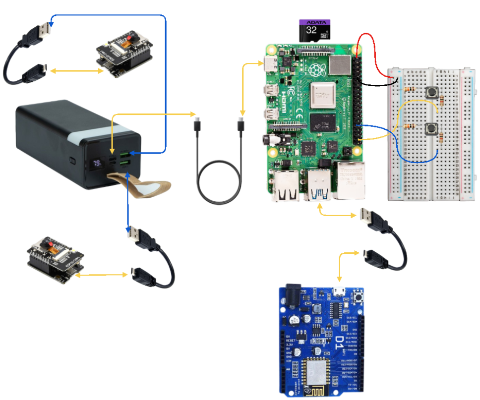
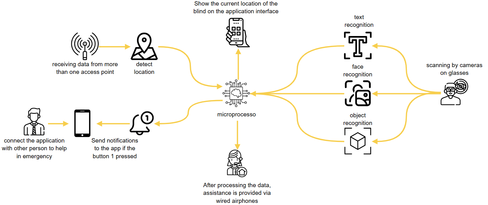

# 👓 Smart Glasses with Voice Assistance

A senior graduation project from the Arab American University that provides assistive technology for the blind people. This system integrates voice-assisted smart glasses with real-time face recognition, object detection, text reading, and indoor positioning to enhance the independence and safety of blind users, especially in university environments.

## 📖 Project Description

Blind individuals face challenges navigating spaces and accessing information independently. Our smart glasses system is designed to solve this by offering:

- **Face Recognition** to identify people nearby
- **Text Recognition & Reading** using OCR
- **Real-Time Object Detection**
- **Indoor Positioning System (IPS)** via Wi-Fi scanning
- **Voice Alerts** through wired earphones
- **Mobile App Integration** for control and location tracking

The solution is focused on improving daily life and safety for the blind by combining embedded systems, machine learning, mobile development, and cloud integration.

## 🧠 System Overview

The system consists of:

- A wearable smart glass with dual cameras
- Wired earphones for real-time audio feedback
- A Raspberry Pi 4 for image processing
- ESP32-CAM and ESP8266 modules for vision and IPS
- A Flutter mobile app for caregiver tracking and management
- A Firebase backend for authentication and data storage

## 🔧 Hardware Used

| Component                      | Purpose                                  |
|-------------------------------|------------------------------------------|
| Raspberry Pi 4 Model B        | Core processor for real-time functions   |
| ESP32-CAM                     | Face/object recognition camera           |
| ESP8266 (WeMos D1 R2)         | Indoor positioning via Wi-Fi scanning    |
| Wired Earphones               | Audio output for blind user              |
| Power Bank (40,000 mAh)       | Power supply for portability             |
| Push Buttons (2)              | Triggering emergency and OCR features    |
| Glasses Frame                 | Mounting all components comfortably      |

## 🛠️ Software Used

| Tool / Language      | Use Case                                        |
|----------------------|-------------------------------------------------|
| Python               | Image processing, model execution               |
| OpenCV, TensorFlow Lite | Object detection, face recognition         |
| Tesseract OCR        | Text recognition                               |
| Firebase             | Authentication & real-time database            |
| Flutter + Android Studio | Mobile application for PA (caregiver)     |
| Arduino IDE          | Programming ESP32 and ESP8266                  |
| Teachable Machine    | Creating custom object detection models        |
| PuTTY & VNC Viewer   | Raspberry Pi access and configuration          |

## 🧱 Block Diagram

The smart glasses system performs:
- Continuous environment scanning
- Voice output to the user
- Real-time syncing with Firebase
- Alerts to the caregiver app when needed

## 📱 Mobile App Features

- QR code to pair glasses with a user account
- Location tracking inside buildings
- Add/view/delete recognized faces
- Notification system from the blind user
- Firebase for storage & real-time sync

APK Download 👉 [Download here](https://drive.google.com/file/d/10aO4Wez3nkSgCMb6-xXFlDI-tKPxmDXx/view?usp=drive_link)
📦 App Source Code 👉 [View Flutter App Repository](git@github.com:basantjaradat/seniorproject-application.git)

## ✅ Project Goals

- Improve mobility for blind individuals inside campuses
- Enable face and object recognition in real time
- Provide emergency alerts and real-time voice assistance
- Allow caregivers to track the user’s location and manage recognized faces

## 🙋‍♀️ Team

- **Basant Jaradat**  
- **Maria Ghanem**  
Supervised by: **Prof. Dr. Hazem Khanfar**

> 🎓 Senior Project (II) | Arab American University – 2024/2025

